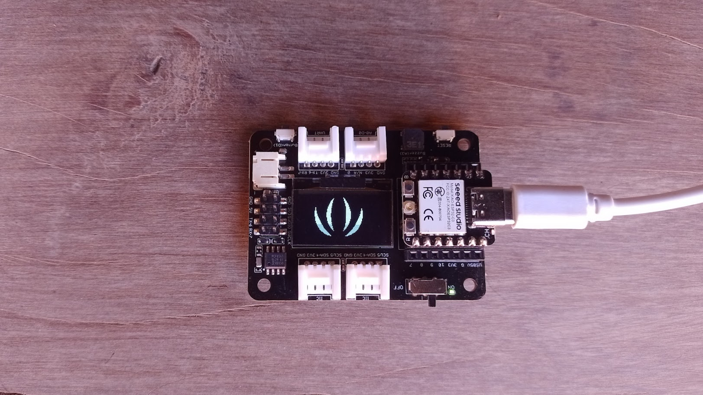

# Using Bitmaps on OLED

# Description
This is an example of using the OLED on the XIAO Expansion Base with an ESP32-C3 board. A bitmap (Seeed Studio logo) is displayed in both normal and inverted modes.



# Libraries
This project uses the `ssd1306.py` library created by [rdagger](https://github.com/rdagger/micropython-ssd1306). It has been included under the MIT license.
You need to copy it to the \lib folder of the XIAO manually or using **MIP**.

```python annotate
>>> import network
>>> wlan=network.WLAN (network.STA_IF)
>>> wlan.active (True)
True
>>> wlan.connect ("xxxx", "xxxx")
>>> import mip
>>> mip.install ("https://raw.githubusercontent.com/rdagger/micropython-ssd1306/refs/heads/main/ssd1306.py")
Downloading https://raw.githubusercontent.com/rdagger/micropython-ssd1306/refs/heads/main/ssd1306.py to /lib
Copying: /lib/ssd1306.py
Done
>>> 

```

# Images  
The code loads the `seeedLogo.mono` image from the **images** folder in the file system.

This image and the original BMP format version are located in the **images** folder of the repository. In the same folder, you'll find the **img2monoHMSB.py** program, which converts the BMP image to the monoHMSB format.
To perform this conversion, type the following in a command window:

```
python img2monoHMSB.py seeedLogo.bmp
```

The generated `seeedLogo.mono` file must be uploaded to the **images** folder on the XIAO.
