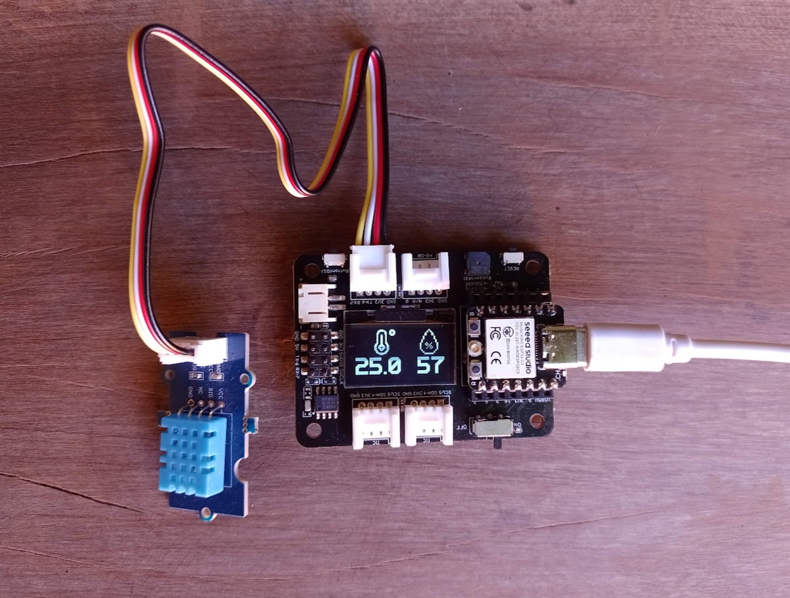

# Temperature and Humidity Sensor with DHT11

# Description  
This project consists of a temperature and humidity sensor based on the **XIAO ESP32-C3** board and the **Grove DHT11** module. The module connects to the Expansion Board, and the temperature and humidity values are displayed on the OLED display.  
Large fonts are used for the numeric values, and bitmap images related to the measurements are displayed.



# Libraries  
This project uses [rdagger's library](https://github.com/rdagger/micropython-ssd1306) to control the OLED.  
You need to install the OLED library (`ssd1306.py`) and the font-handling library (`xglcd_font.py`). This can be done manually or using MIP:

```python annotate
>>> import network
>>> wlan=network.WLAN (network.STA_IF)
>>> wlan.active (True)
True
>>> wlan.connect ("xxxx", "xxxx")
>>> import mip
>>> mip.install ("https://raw.githubusercontent.com/rdagger/micropython-ssd1306/refs/heads/main/ssd1306.py")
Downloading https://raw.githubusercontent.com/rdagger/micropython-ssd1306/refs/heads/main/ssd1306.py to /lib
Copying: /lib/ssd1306.py
Done
>>> mip.install ("https://raw.githubusercontent.com/rdagger/micropython-ssd1306/refs/heads/main/xglcd_font.py")
Downloading https://raw.githubusercontent.com/rdagger/micropython-ssd1306/refs/heads/main/xglcd_font.py to /lib
Copying: /lib/xglcd_font.py
Done
>>> 

```
