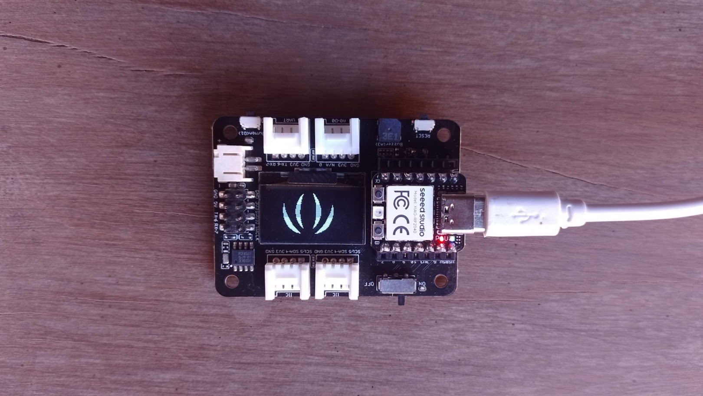

# Using Bitmaps on OLED

# Description
This is an example of using the OLED from the Expansion Base with a **XIAO RP2040** board. A bitmap (Seeed Studio logo) is displayed in both direct and inverse modes.



# Libraries
This project uses the `ssd1306.py` library created by [rdagger](https://github.com/rdagger/micropython-ssd1306). It has been included under the MIT license.  
You need to copy it to the XIAO manually (it cannot be installed using Thonny's Package Manager).

Download it from the URL provided above as a .ZIP file and then copy the **ssd1306.py** file to the XIAO's filesystem.

# Images
The code loads the `seeedLogo.mono` image from the **images** folder in the filesystem.

This image and the original BMP format are in the **images** folder of the repository. In the same folder, you will find the **img2monoHMSB.py** program, which converts the BMP image to monoHMSB format.

This is done as follows:

(In the command window)

```
python img2monoHMSB.py seeedLogo.bmp
```

The generated `seeedLogo.mono` file must be uploaded to the **images** folder of the XIAO.
