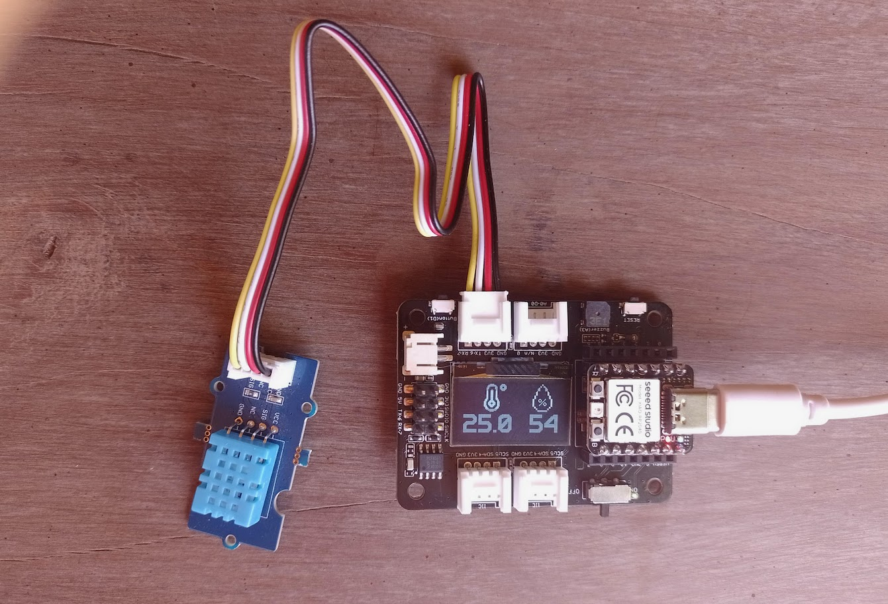

# Temperature and Humidity Sensor with DHT11

# Description
This project consists of a temperature and humidity sensor based on the **XIAO RP2040** board and the **Grove DHT11** module. The module connects to the Expansion Board, and the temperature and humidity values are displayed on the OLED display.  
Large fonts are used for the numeric values, and bitmap images related to the measurements are shown.



# Libraries
This project uses the [rdagger library](https://github.com/rdagger/micropython-ssd1306) to control the OLED.  
You need to install the OLED library (`ssd1306.py`) and the font handling library (`xglcd_font.py`). This can be done manually or using MIP:


```python annotate
>>> import network
>>> wlan=network.WLAN (network.STA_IF)
>>> wlan.active (True)
True
>>> wlan.connect ("xxxx", "xxxx")
>>> import mip
>>> mip.install ("https://raw.githubusercontent.com/rdagger/micropython-ssd1306/refs/heads/main/ssd1306.py")
Downloading https://raw.githubusercontent.com/rdagger/micropython-ssd1306/refs/heads/main/ssd1306.py to /lib
Copying: /lib/ssd1306.py
Done
>>> mip.install ("https://raw.githubusercontent.com/rdagger/micropython-ssd1306/refs/heads/main/xglcd_font.py")
Downloading https://raw.githubusercontent.com/rdagger/micropython-ssd1306/refs/heads/main/xglcd_font.py to /lib
Copying: /lib/xglcd_font.py
Done
>>> 

```
# Fonts
To print the temperature and humidity values on the OLED, the font **PerfectPixel_23x32** is used, which should be copied to the file system of the RP2040 in the folder **fonts**

# Images
Two bitmap images are used to accompany the numeric values. These are **TempIcon.mono** and **HumIcon.mono**, which should be copied to the file system in the folder **images**

