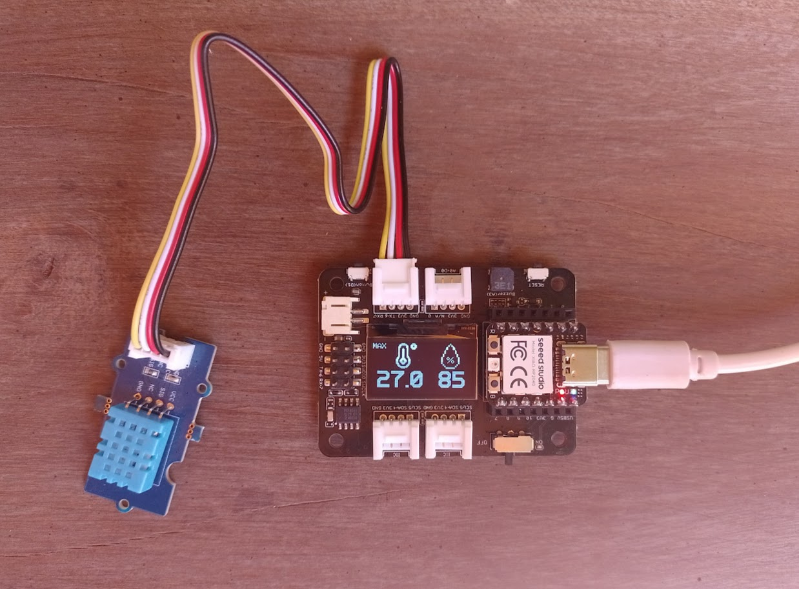
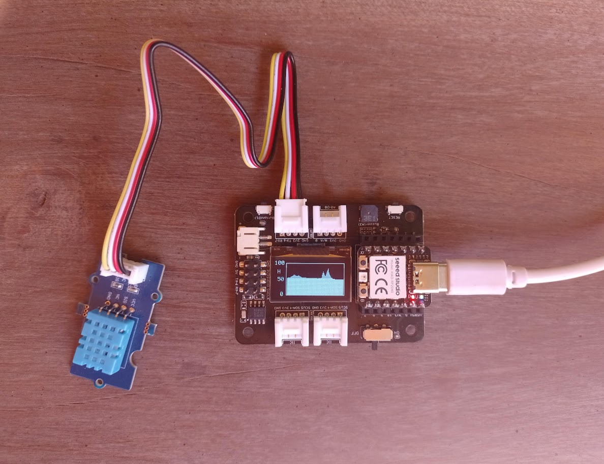

# Multifunction Temperature and Humidity Sensor

# Description
This project consists of a temperature and humidity sensor based on the **XIAO RP2040** board and the **Grove DHT11** module. The module connects to the Expansion Board, and the temperature and humidity values are displayed on the OLED display.






# Libraries  
This project uses the [rdagger library](https://github.com/rdagger/micropython-ssd1306) to control the OLED.  
The OLED library (`ssd1306.py`) and the font handling library (`xglcd_font.py`) need to be installed. This can be done manually or using MIP:

```python annotate
>>> import network
>>> wlan=network.WLAN (network.STA_IF)
>>> wlan.active (True)
True
>>> wlan.connect ("xxxx", "xxxx")
>>> import mip
>>> mip.install ("https://raw.githubusercontent.com/rdagger/micropython-ssd1306/refs/heads/main/ssd1306.py")
Downloading https://raw.githubusercontent.com/rdagger/micropython-ssd1306/refs/heads/main/ssd1306.py to /lib
Copying: /lib/ssd1306.py
Done
>>> mip.install ("https://raw.githubusercontent.com/rdagger/micropython-ssd1306/refs/heads/main/xglcd_font.py")
Downloading https://raw.githubusercontent.com/rdagger/micropython-ssd1306/refs/heads/main/xglcd_font.py to /lib
Copying: /lib/xglcd_font.py
Done
>>> 

```
# Fonts  
The program uses the **PerfectPixel_23x32** and **FixedFont5x8** fonts, which should be copied to the **fonts** folder in the RP2040 file system.

# Images  
Two bitmap images are used to accompany the numeric values. These are **TempIcon.mono** and **HumIcon.mono**, which should be copied to the **images** folder in the RP2040 file system.

# Operation  
The sensor constantly measures temperature and humidity values and stores the last 100 measurements in memory. It has 5 display modes that are selected by sequentially pressing the user button included on the expansion board.  
The display modes are as follows:

- Current Temperature and Humidity: Displays the most recent measured values.  
- Minimum Temperature and Humidity: Displays the minimum values within the last 100 measurements.  
- Maximum Temperature and Humidity: Displays the maximum values within the last 100 measurements.  
- Average Temperature and Humidity: Displays the average values within the last 100 measurements.  
- Temperature Graph: Displays the last 100 temperature measurements in graphical form.  
- Humidity Graph: Displays the last 100 humidity measurements in graphical form.

# Related projects
[Bitmaps demo](https://github.com/profetolocka/XIAO/tree/main/English/RP2040-Base-OLED-Bitmap-Mpy)

[DHT sensor and bitmaps](https://github.com/profetolocka/XIAO/tree/main/English/RP2040-Base-OLED-DHT11-Bitmap-Mpy)

