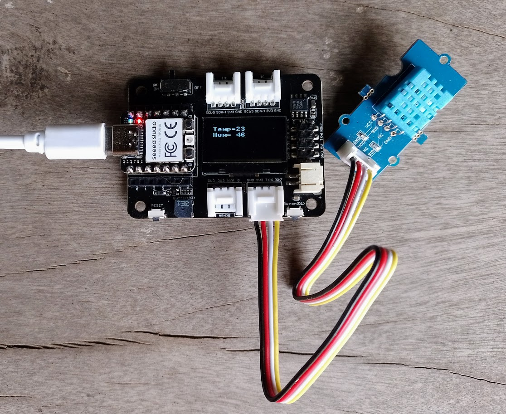

# Lectura de sensor DHT11

# Descripción
Este programa es una demostración de como se leen datos de temperatura y humedad de un módulo **Grove DHT11** usando una placa **XIAO RP2040**.
El módulo **Grove DHT11** se conecta al pin **D7**

# Librerías
Este proyecto utiliza la librería `ssd1306.py` oficial que puede copiarse manualmente al sistema de archivos de la XIAO o a través del **gestor de paquetes** de Thonny.

La librería para leer el DHT11 se encuentra incluída en el firmware de Micropython.
